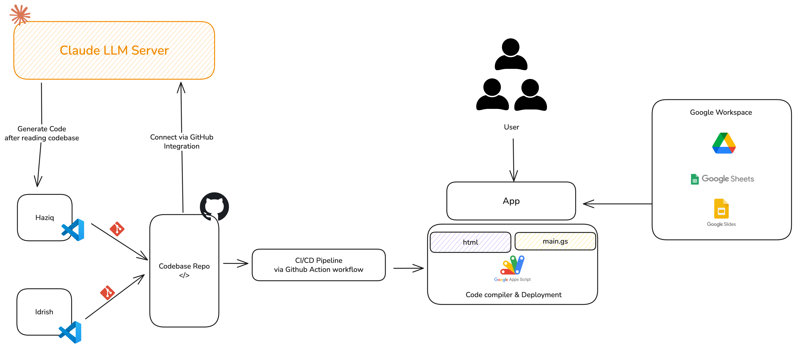

# Vibe Coding Competition

Monorepo for all 5 Vibe coding challenges with automated CI/CD and AI-powered context engineering.

## Context Engineering Architecture

This project leverages **solid context engineering** to maintain code consistency and quality as the codebase evolves.



### How It Works

1. **GitHub as Central Source of Truth**
   - All code, conventions, utilities, and metadata live in the repository
   - Every commit updates the codebase automatically

2. **Claude GitHub Integration**
   - Claude connects directly to this repository
   - Reads the entire codebase before generating code
   - Has access to:
     - Shared utilities (`shared/utils/`)
     - Code conventions (`docs/CONVENTIONS.md`)
     - Challenge metadata (each challenge's structure)
     - Current CI/CD pipeline configuration
     - Recent commit history and patterns

3. **Zero-Friction Development**
   - **No manual context entry needed** - Claude automatically sees all latest changes
   - **Self-updating context** - As the codebase evolves, Claude's understanding evolves
   - **Consistent code generation** - Uses existing patterns and utilities
   - **Convention adherence** - Follows documented standards automatically

### Benefits

- **Maintainability**: Changes to shared utilities or conventions are immediately reflected
- **Consistency**: All generated code follows the same patterns and uses the same utilities
- **Efficiency**: No need to copy-paste code into prompts
- **Scalability**: As the project grows, context grows with it automatically

## Quick Start

### 1. Clone & Setup
```bash
git clone <your-repo-url>
cd vibe-coding-comp
chmod +x scripts/*.sh
```

### 2. Initialize Challenges
```bash
# NPM install clasp if you still havent have
npm install -g @google/clasp

# Login to clasp
clasp login

# Initialize each challenge
./scripts/init-challenge.sh 1 "Challenge 1 Title"
./scripts/init-challenge.sh 2 "Challenge 2 Title"
# ... repeat for 3, 4, 5
```

### 3. Setup GitHub Secrets
1. Get clasp credentials:
```bash
   cat ~/.clasprc.json
```
2. Go to GitHub repo → Settings → Secrets → Actions
3. Create secret `CLASP_TOKEN` with the content

### 4. Connect Claude to GitHub
1. In Claude.ai, go to integrations
2. Connect GitHub and authorize this repository
3. Claude can now read your codebase automatically

## Development Workflow

### Working on a Challenge
```bash
# Create feature branch
git checkout -b feature/challenge-2-api

# Edit code
code challenges/challenge-2/src/main.js

# Test locally
./scripts/deploy-challenge.sh 2

# Commit and push
git add challenges/challenge-2/
git commit -m "feat(c2): add API integration"
git push origin feature/challenge-2-api
```

### Auto-Deployment
- **Push to master** → Auto-detects changed challenges → Deploys only those
- **Shared code changes** → Deploys ALL challenges automatically

### Manual Deployment

**Via GitHub:**
- Go to Actions → Deploy Changed Challenges → Run workflow
- Enter challenge numbers: `1,3,5` or `all`

**Via CLI:**
```bash
# Single challenge
./scripts/deploy-challenge.sh 3

# All challenges
./scripts/deploy-all.sh
```
## Working with Claude

### Get code help
```
"Claude, check challenges/challenge-3/src/ and help me add email
validation. Use the shared utilities if applicable."
```

### Review architecture
```
"Claude, review challenges/challenge-1/ and challenge-2/ and tell me
if there's duplicated code we should move to shared/utils/"
```

### Debug deployment
```
"Claude, check the recent commit changes in challenges/challenge-4/
and tell me why the deployment might be failing."
```

## CI/CD Pipeline

The project uses GitHub Actions for automated deployment of Apps Script challenges. The pipeline is intelligent and only deploys what's changed.


### Pipeline Architecture

```
Push to main → Detect Changes → Validate → Deploy → Notify
```

### How It Works

#### 1. **Trigger Mechanisms** (.github/workflows/deploy-challenges.yml:4-15)

- **Automatic**: Push to `main` branch with changes in `challenges/` or `shared/`
- **Manual**: GitHub Actions UI with custom challenge selection (`1,2,3` or `all`)

#### 2. **Change Detection** (.github/workflows/deploy-challenges.yml:18-84)

The pipeline intelligently detects what needs deployment:

- **Challenge-specific changes**:
  - Scans `git diff` for modified files
  - Extracts challenge numbers from paths like `challenges/challenge-3/src/main.js`
  - Deploys only affected challenges

- **Shared utilities changes**:
  - Detects changes in `shared/` directory
  - **Triggers deployment of ALL challenges** (since they all use shared code)

- **Manual override**:
  - Allows specifying exact challenges: `1,3,5`
  - Or deploy everything: `all`

#### 3. **Validation** (.github/workflows/deploy-challenges.yml:86-115)

Before deployment, each challenge is validated:

```bash
# JavaScript syntax check
find challenges/challenge-N/src -name "*.js" -exec node --check {} \;
```

- Runs in parallel for all affected challenges (matrix strategy)
- Fails fast if syntax errors detected
- Prevents deploying broken code to production

#### 4. **Deployment Process** (.github/workflows/deploy-challenges.yml:117-271)

For each challenge, the pipeline:

**a) Setup** (lines 126-181)
- Installs Node.js and `clasp` CLI
- Configures Google Apps Script credentials from `CLASP_TOKEN` secret
- Handles both legacy and new token formats automatically

**b) Prepare Shared Code** (lines 183-195)
```bash
# Copy shared utilities into challenge
cp -r shared/utils/* challenges/challenge-N/src/shared/
```

**c) Deploy to Google Apps Script** (lines 197-271)
- Validates `.clasp.json` exists with valid `scriptId`
- Pushes code: `clasp push -f`
- Updates existing deployment or creates new one
- Extracts deployment ID and generates web app URL

**d) Handle Deployment Types**
- **Existing deployment**: Updates in-place (`clasp deploy --deploymentId`)
- **New deployment**: Creates with description, provides manual setup instructions

#### 5. **Notification & Reporting** (.github/workflows/deploy-challenges.yml:273-316)

- Creates deployment summary for each challenge
- Adds commit comment with deployment status
- Shows web app URLs and deployment IDs

### Local Deployment Script

The `scripts/deploy-challenge.sh` script mirrors CI/CD behavior for local testing:

```bash
./scripts/deploy-challenge.sh 3
```

**What it does** (scripts/deploy-challenge.sh:1-60):

1. **Validates** challenge exists and has `.clasp.json`
2. **Copies** shared utilities to challenge directory
3. **Pushes** code to Apps Script
4. **Deploys** with timestamp description
5. **Shows** Apps Script editor URL

### Key Features

- **Parallel Execution**: Multiple challenges deploy simultaneously (fail-fast: false)
- **Smart Dependencies**: Shared code changes cascade to all challenges
- **Idempotent**: Can re-run safely, updates existing deployments
- **Self-Documenting**: GitHub Step Summary shows deployment status
- **Zero Downtime**: Updates existing deployments instead of creating new ones

### Troubleshooting CI/CD

| Issue | Solution |
|-------|----------|
| "scriptId not set" | Run `clasp create` locally first |
| "Invalid token" | Update `CLASP_TOKEN` secret from `~/.clasprc.json` |
| Deployment failed | Check GitHub Actions logs for specific error |
| Shared code not deployed | Verify files are in `shared/utils/` directory |

## Project Structure
```
vibe-coding-comp/
├── challenges/          # 5 independent Apps Script projects
├── shared/             # Shared utilities across challenges
├── docs/               # Documentation
├── scripts/            # Deployment scripts
└── .github/workflows/  # CI/CD automation
```

## Useful Commands

| Command | Description |
|---------|-------------|
| `./scripts/deploy-challenge.sh N` | Deploy specific challenge |
| `./scripts/deploy-all.sh` | Deploy all challenges |
| `clasp open` | Open Apps Script editor (from challenge dir) |
| `clasp logs` | View execution logs |
| `clasp deployments` | List all deployments |

## Troubleshooting

### "No .clasp.json found"
Run `./scripts/init-challenge.sh <number>` first

### "Deployment failed"
1. Check GitHub Actions logs
2. Verify `CLASP_TOKEN` secret is set
3. Test locally: `cd challenges/challenge-N && clasp push`

### "Permission denied"
```bash
chmod +x scripts/*.sh
```

## Links
- [Challenge Index](docs/challenge-index.md)
- [Conventions](docs/CONVENTIONS.md)
- [Architecture](docs/ARCHITECTURE.md)